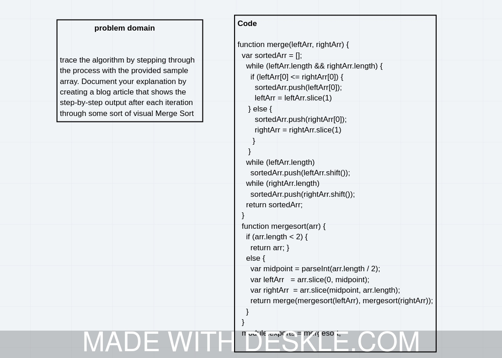

# Challenge Summary
<!-- Description of the challenge -->
trace the algorithm by stepping through the process with the provided sample array. Document your explanation by creating a blog article that shows the step-by-step output after each iteration through some sort of visual Merge Sort

## Whiteboard Process
<!-- Embedded whiteboard image -->

## Solution
<!-- Show how to run your code, and examples of it in action -->
function merge(leftArr, rightArr) {
  var sortedArr = [];
    while (leftArr.length && rightArr.length) {
      if (leftArr[0] <= rightArr[0]) {
        sortedArr.push(leftArr[0]);
        leftArr = leftArr.slice(1)
     } else {
        sortedArr.push(rightArr[0]);
        rightArr = rightArr.slice(1)
       }
     }
    while (leftArr.length)
      sortedArr.push(leftArr.shift());
    while (rightArr.length)
      sortedArr.push(rightArr.shift());
    return sortedArr;
  }
  function mergesort(arr) {
    if (arr.length < 2) {
      return arr; }
    else {
      var midpoint = parseInt(arr.length / 2);
      var leftArr   = arr.slice(0, midpoint);
      var rightArr  = arr.slice(midpoint, arr.length);
      return merge(mergesort(leftArr), mergesort(rightArr));
    }
  }
  module.exports = mergesort;

