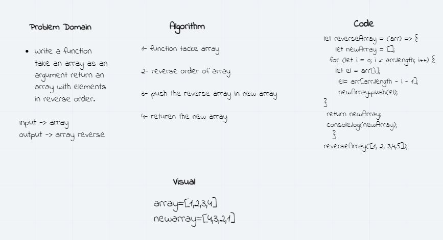
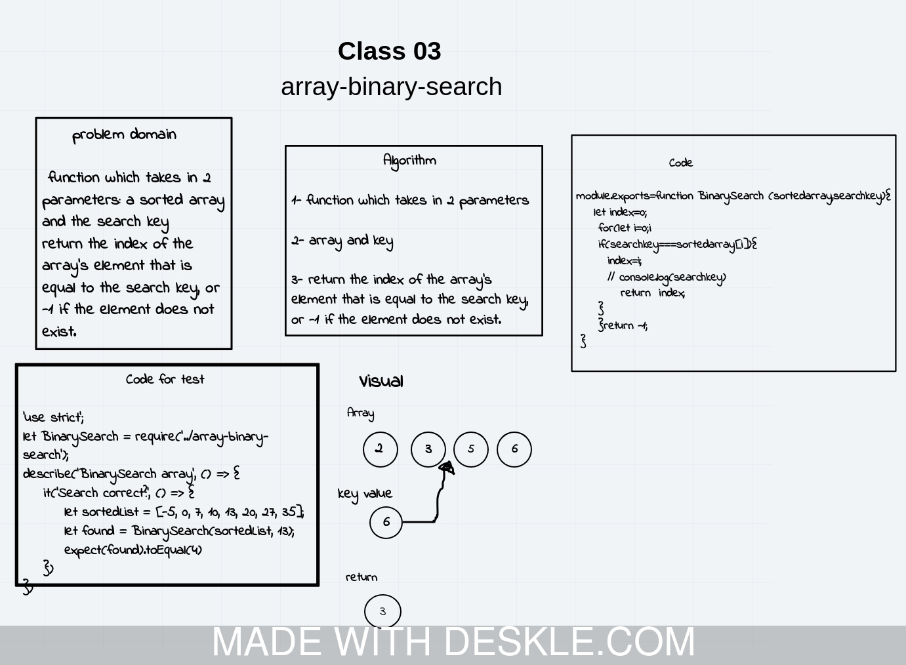

# Data Structures and Algorithms

See [setup instructions](https://codefellows.github.io/setup-guide/code-301/3-code-challenges), in the Code 301 Setup Guide.

## Repository Quick Tour and Usage

### 301 Code Challenges

Under the `data-structures-and-algorithms` repository, at the top level is a folder called `code-challenges`

Each day, you'll add one new file to this folder to do your work for the day's assigned code challenge

### 401 Data Structures, Code Challenges

- Please follow the instructions specific to your 401 language, which can be found in the directory below, matching your course.

## Code Challenge: Class 01

# Challenge Summary
<!-- Short summary or background information -->

function takes in 2 parameters: a sorted array and the search key and return the index of search key

## Challenge Description
<!-- Description of the challenge -->
input (sorted array and the search key)

output the index of search key

## Approach & Efficiency
<!-- What approach did you take? Why? What is the Big O space/time for this approach? -->

## Solution
<!-- Embedded whiteboard image -->

             module.exports=function BinarySearch (sortedarray,searchkey){
    let index=0;
     for(let i=0;i<sortedarray.length;i++){
     if(searchkey===sortedarray[i]){
       
       index=i;
       // console.log(searchkey)
          return  index;
      
     }
     }return -1;
           } 
     
      //  BinarySearch([4,8,15,23,42],23);

