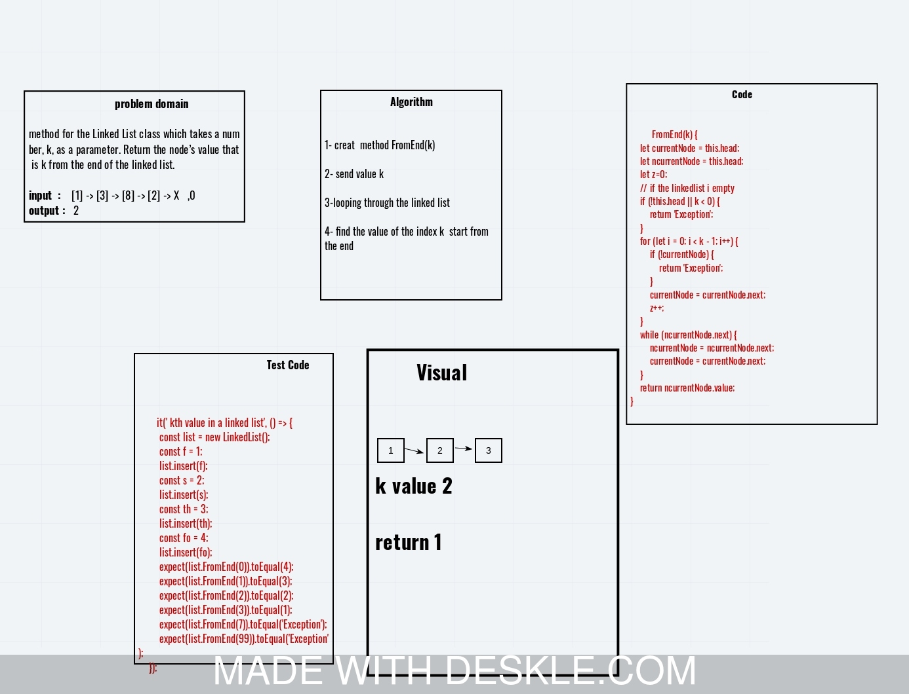

# Data Structures and Algorithms

See [setup instructions](https://codefellows.github.io/setup-guide/code-301/3-code-challenges), in the Code 301 Setup Guide.

## Repository Quick Tour and Usage

### 301 Code Challenges

Under the `data-structures-and-algorithms` repository, at the top level is a folder called `code-challenges`

Each day, you'll add one new file to this folder to do your work for the day's assigned code challenge

### 401 Data Structures, Code Challenges

- Please follow the instructions specific to your 401 language, which can be found in the directory below, matching your course.

## Code Challenge: Class 01

# Challenge Summary
<!-- Short summary or background information -->
input array and the value   [2,4,6,8],5
output  array with the new value added at the middle index [2,4,5,6,8]

## Challenge Description
<!-- Description of the challenge -->
function which takes in an array and the value to be added and  return an array with the new value added at the middle index.

## Solution
<!-- Embedded whiteboard image -->

             module.exports=function BinarySearch (sortedarray,searchkey){
    let index=0;
     for(let i=0;i<sortedarray.length;i++){
     if(searchkey===sortedarray[i]){
       
       index=i;
       // console.log(searchkey)
          return  index;
      
     }
     }return -1;
           } 
     
      //  BinarySearch([4,8,15,23,42],23);

<!------------------------------ class 06 ---------------------------------->

# Challenge Summary
<!-- Description of the challenge -->
methods for the Linked List class 
- .insertBefore(value, newVal) which add a new node with the given newValue immediately before the first value node
- .insertAfter(value, newVal) which add a new node with the given newValue immediately after the first value node

## Whiteboard Process
<!-- Embedded whiteboard image -->

<!------------------------------ class 07 ---------------------------------->

# Challenge Summary
<!-- Description of the challenge -->
method for the Linked List class which takes a number, k, as a parameter. Return the node’s value that is k from the end of the linked list. 

## Whiteboard Process
<!-- Embedded whiteboard image -->

<!-- Challenges class 5 -->

# Singly Linked List
<!-- Short summary or background information -->
sequence of Nodes that are connected/linked to each other.

## Challenge
<!-- Description of the challenge -->
Create a Node class that has properties for the value stored in the Node, and a pointer to the next Node.

## Approach & Efficiency
<!-- What approach did you take? Why? What is the Big O space/time for this approach? -->
1.create node class.
2.create a methods:insert,includes,toString.
3.make tests for all methods

## API
<!-- Description of each method publicly available to your Linked List -->

