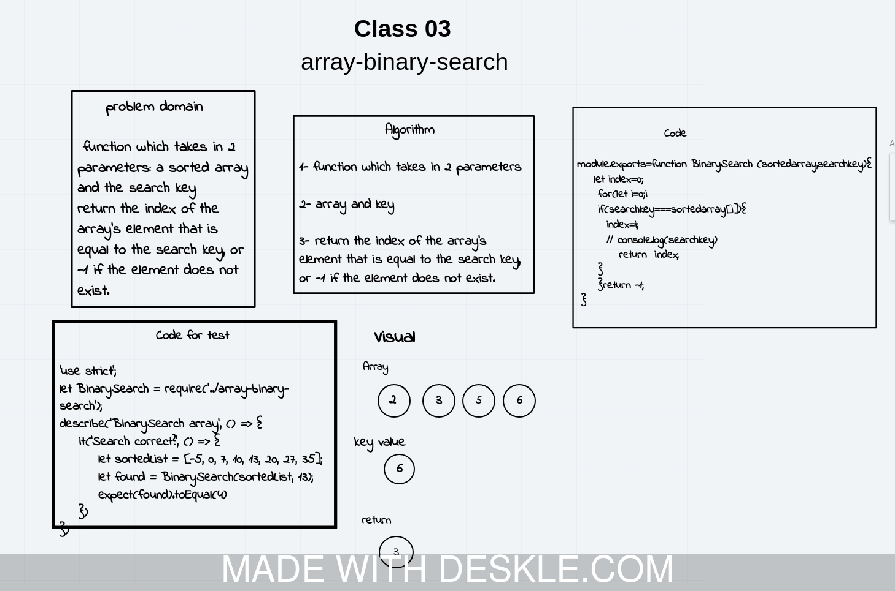

## Code Challenge: Class 02

# Challenge Summary
<!-- Short summary or background information -->
input array and the value   [2,4,6,8],5
output  array with the new value added at the middle index [2,4,5,6,8]

## Challenge Description
<!-- Description of the challenge -->
function which takes in an array and the value to be added and  return an array with the new value added at the middle index.

## Solution
<!-- Embedded whiteboard image -->

             module.exports=function BinarySearch (sortedarray,searchkey){
    let index=0;
     for(let i=0;i<sortedarray.length;i++){
     if(searchkey===sortedarray[i]){
       
       index=i;
       // console.log(searchkey)
          return  index;
      
     }
     }return -1;
           } 
     
      //  BinarySearch([4,8,15,23,42],23);

