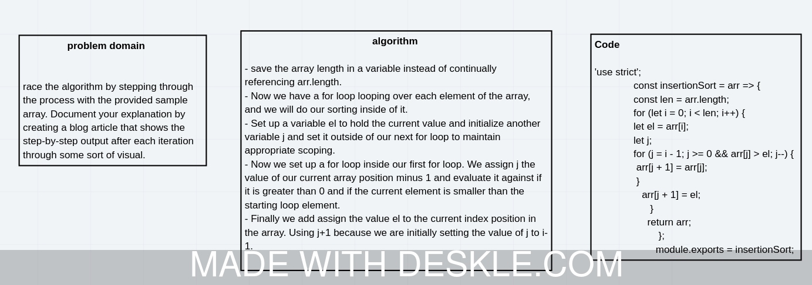

# Challenge Summary
<!-- Description of the challenge -->
implementation of Insertion Sort

## Whiteboard Process
<!-- Embedded whiteboard image -->

## Solution
<!-- Show how to run your code, and examples of it in action -->
             'use strict';

              const insertionSort = arr => {
              const len = arr.length;
              for (let i = 0; i < len; i++) {
              let el = arr[i];
              let j;
        
              for (j = i - 1; j >= 0 && arr[j] > el; j--) {
               arr[j + 1] = arr[j];
               }
                 arr[j + 1] = el;
                    }
                   return arr;
                       };

                      module.exports = insertionSort;