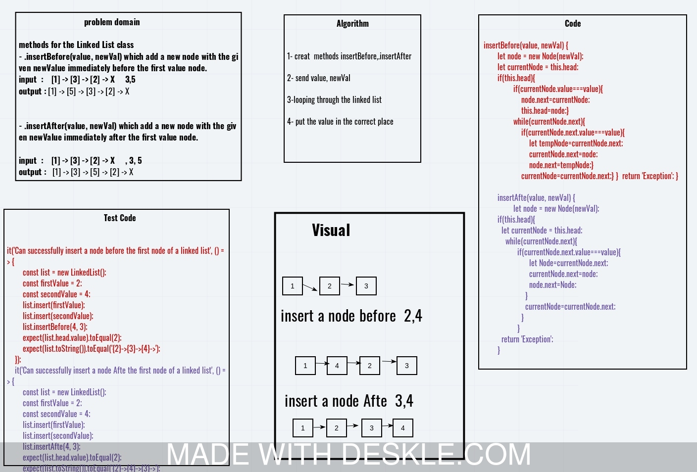
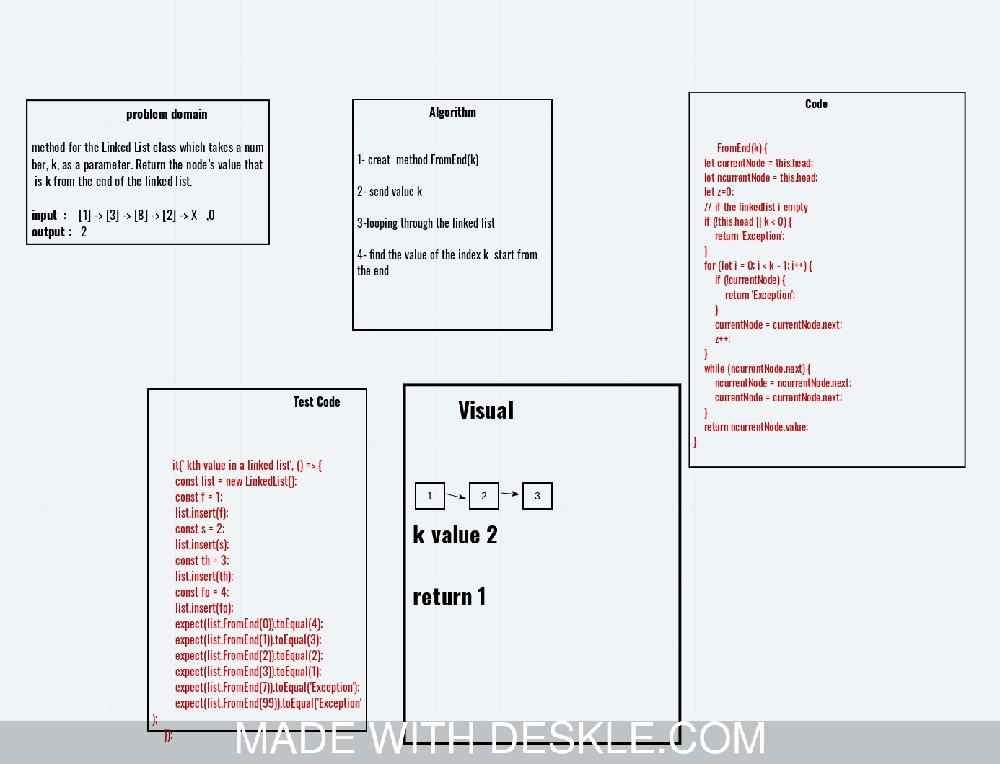
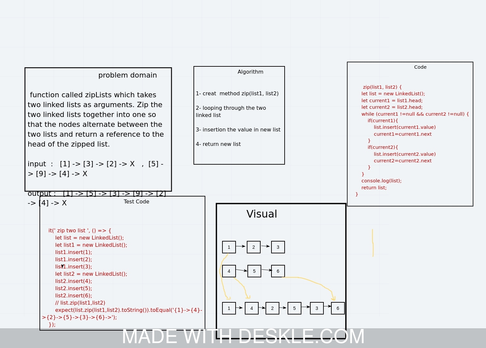

##Challenges class 5

## Singly Linked List
<!-- Short summary or background information -->
sequence of Nodes that are connected/linked to each other.

## Challenge
<!-- Description of the challenge -->
Create a Node class that has properties for the value stored in the Node, and a pointer to the next Node.

## Approach & Efficiency
<!-- What approach did you take? Why? What is the Big O space/time for this approach? -->
1.create node class.
2.create a methods:insert,includes,toString.
3.make tests for all methods

# class 06 ---------------------------------->

# Challenge Summary
<!-- Description of the challenge -->
methods for the Linked List class 
- .insertBefore(value, newVal) which add a new node with the given newValue immediately before the first value node
- .insertAfter(value, newVal) which add a new node with the given newValue immediately after the first value node

## Whiteboard Process
<!-- Embedded whiteboard image -->

# class 07 ---------------------------------->

# Challenge Summary
<!-- Description of the challenge -->
method for the Linked List class which takes a number, k, as a parameter. Return the node’s value that is k from the end of the linked list. 

## Whiteboard Process
<!-- Embedded whiteboard image -->

# class 08 ---------------------------------->

# Challenge Summary
<!-- Description of the challenge -->
function called zipLists which takes two linked lists as arguments. Zip the two linked lists together into one so that the nodes alternate between the two lists and return a reference to the head of the zipped list.

## Whiteboard Process
<!-- Embedded whiteboard image -->
