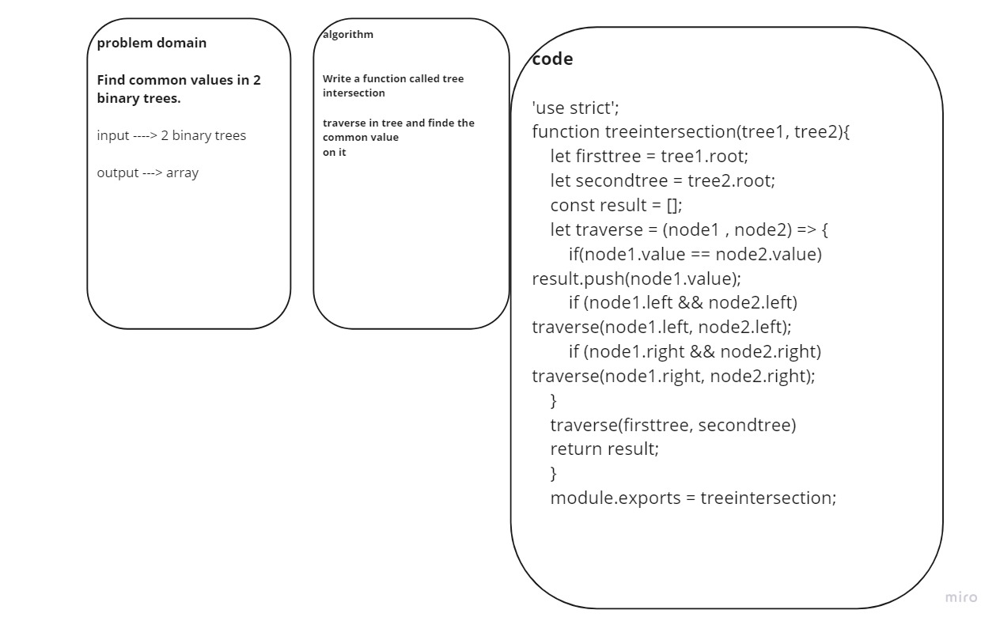

# Challenge Summary
<!-- Description of the challenge -->
Find common values in 2 binary trees
Write a function called tree intersection

## Whiteboard Process
<!-- Embedded whiteboard image -->

## Solution
<!-- Show how to run your code, and examples of it in action -->
'use strict';

function treeintersection(tree1, tree2){
    
    let firsttree = tree1.root;
    let secondtree = tree2.root;
    const result = [];
    let traverse = (node1 , node2) => {
        if(node1.value == node2.value) result.push(node1.value);
        if (node1.left && node2.left) traverse(node1.left, node2.left);
        if (node1.right && node2.right) traverse(node1.right, node2.right);
    }
    traverse(firsttree, secondtree)
    return result;
    }
    module.exports = treeintersection;