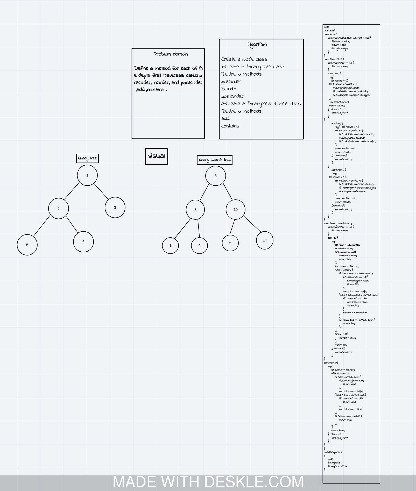
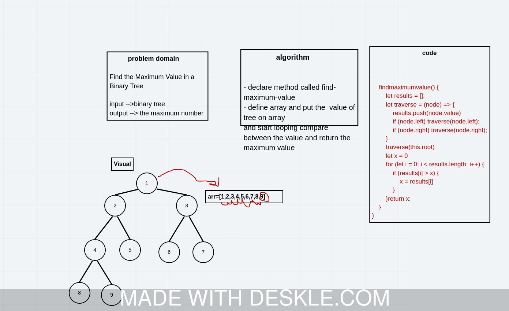

# Code Challenge: Class 15: Binary Tree and BST Implementation

# Trees
<!-- Short summary or background information -->
 A tree is a nonlinear data structure, compared to arrays, linked lists, stacks and queues which are linear data structures. A tree can be empty with no nodes or a tree is a structure consisting of one node called the root and zero or one or more subtrees.

## Challenge
<!-- Description of the challenge -->
Define a method for each of the depth first traversals called preOrder, inOrder, and postOrder ,add ,contains .

# Code Challenge: Class 16: Maximum Value in a Binary Tree

## Challenge
<!-- Description of the challenge -->
Find the Maximum Value in a Binary Tree

